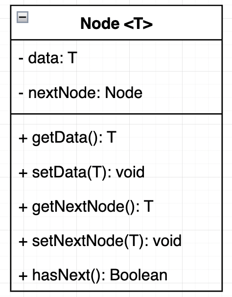
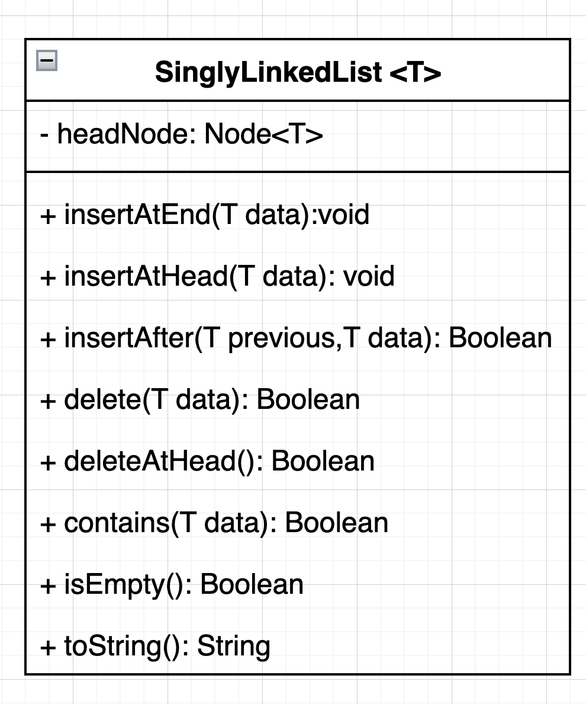

# What is the Singly Linked List (SLL)

## Introduction

**Linked Lists** and **Arrays** are quite similar in characteristics as they are both used to store a collection of the same type of data. A data type can be anywhere from a simple primitive integer to a complex object of a particular class. However, the structure of the Linked List is very different as compared to Arrays.

## Applications

Some important applications of Linked Lists include:

* Implementing HashMaps, File System and Adjacency Lists
* Dynamic memory allocation: We use linked lists of free blocks
* Performing arithmetic operations on long integers
* Maintaining a directory of names

## Structure of Linked List 

A linked list is formed by nodes that are linked together like a chain. Each node holds data, along with a pointer to the next node in the list. The Singly Linked List (SLL) is the type of linked list where each node has only one pointer that stores the reference to the next value. The following illustraion shows a Singly Linked List.

To implement a linked list, we need the following two classes:

* Class Node
* Class LinkedList

## Class Node

The **Node** class stores data in a single node. It can store primitive data such as integers and string as well as complex objects having multiple attributes. Along with data, it also stores a pointer to the next element in the list, which helps in linking the nodes together like a chain. Here’s a typical definition of a **Node** class:

**Explanation**: The uml above provides a basic definition of a Node class structure with two data members: 

* one to hold the data and the other 
* one to store a reference to the next element. 

This class is a generic class made by using Java Generics. The data variable can hold any data-type value specified.

| Operations | Descriptions |
| ---------- | ------------ |
| insertAtEnd | Inserts an element at the end of the linked list|
| insertAtHead | Inserts an element at the start/head of the linked list|
| insertAfter | Inserts an element after a specified value already contained in list|
| delete | Deletes the first occurance of value in the list |
| deleteAtHead | Deletes the first element of the list |
| deleteAtEnd | Deletes the last element of the list |
| contains | Returns true if value is in the list |
| isEmpty | Returns true if the list is empty |
| toString | Returns a string of all the values contained in list|

### isEmpty()
The basic condition for our list to be considered empty is that the **head** should be the only pointer in the list. This implies that the head points to NULL.

#### Time Complexity

The time complexity of isEmpty() method is O(1).

### insertAtHead

This type of insertion means that we want to insert a new element as the first element of the list. As the head always points to the first element of the list, insertion at head means that we are inserting the first element in the list.

#### Time Complexity

The time complexity of insertAtHead() method is O(1).

### insertAtEnd

This type of insertion means that we want to insert a new element as the last element of the list. The original tail element of the list has a nextElement pointer that points to NULL. To insert a new tail node, we have to point the nextElement pointer of the previous tail node to the new tail node, allowing the nextElement of the new tail to now point to NULL.

The time complexity of insertAtEnd() method is O(n).

### insertAfter

This insertion is a little more tricky when compared to insert at the head and insert at the end. Here, we specify the node (e.g. n), after which we want to insert the new node. To insert this node, we follow these steps:

1. We traverse the linked list to look for n.
2. As soon as we find it, we assign n's nextElement to the new node’s nextElement.
3. Then we point n's nextElement to the new node.

The time complexity of insertAfter() method is O(n).

### contains

This contains returns true of the item appears in the list True or False.

The time complexity of contains() method is O(n).

### delete

This type of deletion means that we want to remove the first occurrence element of the list. 

The time complexity of delete() method is O(n).

### deleteAtHead

This type of deletion means that we want to remove the first element of the list. As the head always points to the first element of the list.

The time complexity of deleteAtHead() method is O(1).

### deleteAtEnd

This type of deletion means that we want to remove the first element of the list. As the head always points to the first element of the list.

The time complexity of deleteAtEnd() method is O(n).

### toString

This will return a string of all the elements in the list as a string seperated by a comma

"One", "Two", "Three"

The time complexity of toString() method is O(n).